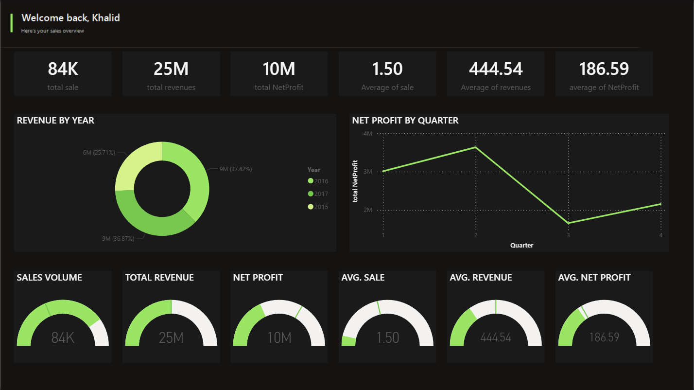

# Sales Performance Dashboard | Power BI

> Academic portfolio project by **KHALID BAHADILAH**

An executive-style Power BI dashboard that turns AdventureWorks sales files into a clear view of sales volume, revenue, profitability, yearly performance, and quarterly profit trends.



## Project Objective

The goal of this project is to make sales performance easy to monitor from a single page. The dashboard answers five practical questions:

1. How many units were sold?
2. How much revenue and net profit were generated?
3. How did revenue change across 2015–2017?
4. Which quarter produced the strongest net profit?
5. Which product category contributed the most revenue?

## Executive Summary

| Metric | Result |
|---|---:|
| Sales volume | 84,174 units |
| Total revenue | $24.91M |
| Net profit | $10.46M |
| Average units per sales line | 1.50 |
| Average revenue per sales line | $444.54 |
| Average net profit per sales line | $186.59 |

## Key Insights

- **2016 generated the highest annual revenue** at approximately **$9.32M**, followed closely by 2017 at $9.19M.
- **Q2 was the strongest quarter for net profit**, producing approximately **$3.64M**.
- **Bikes dominated the revenue mix**, contributing approximately **$23.64M**, or **94.9%** of total revenue.
- The business generated an overall net profit margin of approximately **42.0%** based on revenue less product cost.

## Dashboard Features

- Executive KPI cards for volume, revenue, profit, and averages
- Revenue distribution by year
- Quarterly net profit trend
- Gauge visuals for fast performance scanning
- Dark portfolio theme with a consistent lime accent
- One-page layout designed for quick executive review

## Tools and Skills

- **Power BI Desktop** — dashboard development and visualization
- **Power Query** — CSV ingestion and data preparation
- **DAX** — KPI and profitability measures
- **Data Modeling** — relationships across sales, customers, products, categories, returns, and calendar tables
- **Data Storytelling** — translating transactional data into decision-ready insights

## Data Model

```text
Customers ───────┐
Calendar ────────┼── Sales ─── Products ─── Subcategories ─── Categories
                 │                 │
                 └─────────────────┴── Returns
```

## Repository Structure

```text
.
├── assets/
│   ├── dashboard-overview.png
│   └── linkedin/
│       └── slide-01.png ... slide-05.png
├── data/
│   ├── AdventureWorks_Customers.csv
│   ├── AdventureWorks_Products.csv
│   ├── AdventureWorks_Product_Categories.csv
│   ├── AdventureWorks_Product_Subcategories.csv
│   ├── AdventureWorks_Returns.csv
│   ├── AdventureWorks_Sales_2015.csv
│   ├── AdventureWorks_Sales_2016.csv
│   └── AdventureWorks_Sales_2017.csv
├── docs/
│   ├── linkedin-post.md
│   ├── metric-definitions.md
│   └── project-overview.pptx
├── report/
│   └── Sales Performance Dashboard.pbix
├── LICENSE
└── README.md
```

## How to Use

1. Download or clone this repository.
2. Open `report/Sales Performance Dashboard.pbix` in Power BI Desktop.
3. If Power BI requests new source locations, point each query to the matching CSV file in the `data` folder.
4. Select **Refresh** to load the data and update the dashboard.

## Metric Definitions

- **Revenue** = Product Price × Order Quantity
- **Net Profit** = (Product Price − Product Cost) × Order Quantity
- **Sales Volume** = Sum of Order Quantity
- **Average Revenue** = Total Revenue ÷ Sales Line Count
- **Average Net Profit** = Total Net Profit ÷ Sales Line Count

## Data Source and Attribution

This project uses AdventureWorks educational sample data in CSV format. AdventureWorks is a sample database originally published by Microsoft for learning and demonstration purposes.

- [Microsoft AdventureWorks documentation](https://learn.microsoft.com/en-us/sql/samples/adventureworks-install-configure)
- [Microsoft SQL Server samples repository](https://github.com/microsoft/sql-server-samples)

## Author

**KHALID BAHADILAH**  
Data Analytics and Business Intelligence Portfolio Project
